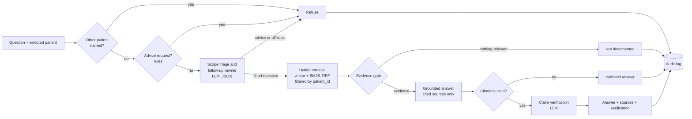

# Clinical Chart Assistant

A retrieval-augmented chart-review assistant for clinicians. Pick a patient, ask a question about their record, and get an answer that cites the exact note sections it came from, with each claim checked against those sources. It refuses to give treatment advice, to talk about other patients, or to guess when the record is silent.

Built on six fictional patients (27 notes plus structured allergies, medications, ICD-10 problems and LOINC-coded labs). **Not for clinical use.**

## What makes it different from a basic RAG demo

| Concern | What this project does |
|---|---|
| Wrong-patient data | Retrieval is hard-filtered by `patient_id` in the database query, re-checked afterward, and tested for every question against every patient. Switching patients resets the conversation. |
| Hallucination | Answers must cite a source on every factual sentence. Citations are validated in code; invalid or missing citations withhold the answer. A second model call verifies each claim, and unverified claims are shown, not hidden. |
| Silence in the record | An evidence gate returns "not documented" without calling the model, and the prompt forbids treating absent documentation as absent disease. |
| Scope | Deterministic rules plus a model-based triage refuse treatment and dosing advice, other-patient questions and off-topic requests. |
| Safety-critical data | Allergy band, problems, medications and lab trends are rendered straight from structured data, never generated. Intolerances are distinguished from allergies. |
| Retrieval quality | Section-aware chunking, clinical abbreviation expansion in both directions (A1c, EF/LVEF, eGFR...), dense plus BM25 search with reciprocal rank fusion. |
| Regression | 51-question golden set with quality gates on every pull request; offline unit tests on every push. |
| Traceability | Audit log per request (hashed patient reference, redacted question, sources, status, model and pipeline versions). Model card and hazard analysis that maps each risk to the tests that verify its controls. |

## Architecture



## Run locally

```bash
git clone https://github.com/<you>/clinical-chart-assistant.git
cd clinical-chart-assistant
python -m venv .venv && source .venv/bin/activate      # Windows: .venv\Scripts\activate
pip install -r requirements-dev.txt
cp .env.example .env                                   # then add your OPENAI_API_KEY
python app.py                                          # http://127.0.0.1:7860
```

The vector index builds on first start (about 140 chunks, a fraction of a cent to embed) and rebuilds automatically whenever the data or embedding model changes.

## Test and evaluate

```bash
python -m pytest                 # 42 offline tests, fake model, no API key needed
python -m eval.run_eval          # full golden-set evaluation with real models; exits 1 if a gate fails
python -m eval.run_eval --limit 10 --no-gate    # quick look
```

The evaluation writes `reports/eval_report.md` and `.json`. Commit `reports/` so the app's Evaluation tab shows the latest results.

| Gate | Threshold |
|---|---|
| Status accuracy (answered / not documented / refused as expected) | ≥ 0.90 |
| Refusal accuracy (advice, other patient, off-topic) | ≥ 0.875 |
| Retrieval hit rate (expected source in top k) | ≥ 0.85 |
| Keyword recall (required facts present) | ≥ 0.85 |
| Answer correctness (LLM judge vs. clinician-style reference) | ≥ 0.80 |
| Faithfulness (claims supported by sources) | ≥ 0.90 |
| Cross-patient leakage | = 0 |

## Deploy

**Hugging Face Space**
1. Create a new Space: SDK Gradio, blank template.
2. In the Space's Settings, add a secret `OPENAI_API_KEY`. Optionally add `APP_USER` and `APP_PASSWORD` to require a login.
3. Push this repository to the Space (the next section automates this), or upload the files.

**GitHub Actions**
In the GitHub repository, go to Settings → Secrets and variables → Actions:
- Secret `OPENAI_API_KEY` enables the eval gate on pull requests.
- Secret `HF_TOKEN` (a Hugging Face token with write access) and variable `HF_SPACE` (for example `navid015/clinical-chart-assistant`) enable automatic deployment after tests pass on `main`.

Then protect `main` and require the **Tests** and **Clinical eval gate** checks, so no change can merge if it lowers quality.

## Project layout

```
app.py                      Gradio interface
chartrag/
  config.py                 settings, all overridable by environment variables
  records.py                loads patient.json and notes
  ingest.py                 section-aware chunking and index build
  retrieval.py              patient-scoped hybrid retrieval
  guardrails.py             advice rules, other-patient check, citation validation
  prompts.py                every prompt, in one reviewable file
  pipeline.py               the request pipeline shown above
  verify.py                 claim-level verification
  audit.py                  redaction and audit log
  llm.py                    model layer, plus an offline fake mode for tests
data/patients/P00N/         synthetic structured data and notes
eval/                       golden set and evaluation harness
tests/                      offline unit tests
docs/                       model card, risk analysis, demo script
.github/workflows/          tests, eval gate, deploy to Hugging Face
```

## Configuration

| Variable | Default | Purpose |
|---|---|---|
| `CHAT_MODEL` | `gpt-4.1-mini` | Answers and scope triage |
| `JUDGE_MODEL` | same as `CHAT_MODEL` | Verifier and eval judge |
| `EMBED_MODEL` | `text-embedding-3-small` | Embeddings |
| `TOP_K` | `6` | Chunks passed to the model |
| `MIN_SIMILARITY` | `0.20` | Evidence gate threshold; tune with the eval |
| `VERIFY_ANSWERS` | `true` | Run claim verification |
| `AUDIT_LOG` | `true` | Write `logs/audit.jsonl` |
| `LLM_MODE` | `openai` | `fake` for offline tests |

## Documentation
- [Model card](docs/MODEL_CARD.md): intended use, design, evaluation, limitations
- [Risk analysis](docs/RISK_ANALYSIS.md): hazards, controls and how each control is verified
- [Demo script](docs/DEMO_SCRIPT.md): a five-minute walkthrough
- [Synthetic data](data/README.md)

This project follows my earlier [UL Lafayette RAG Assistant](https://github.com/navid015/UL_Lafayette_RAG_Assistant), keeping its stack (OpenAI, Chroma, Gradio, Hugging Face Spaces) and adding what a clinical setting requires.
